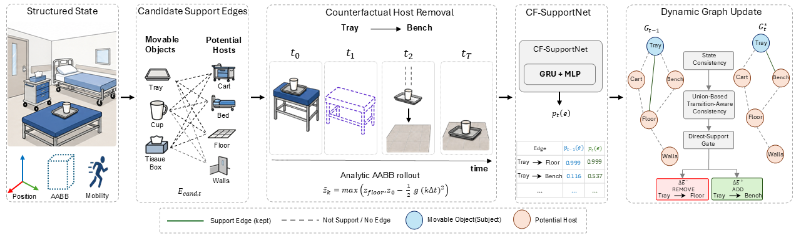

<div align="center">

# MedPhyGraph

### Counterfactual Support-Graph Maintenance for Dynamic Built-Environment Digital Twins

*ECCV 2026 · TwinWorld Workshop: Visual Intelligence for Built Environment Digital Twins*

[](https://www.python.org/)
[](LICENSE)
[](https://medphygraph.github.io/)
[](https://huggingface.co/MedPhyGraph/CF-SupportNet)
[](https://huggingface.co/datasets/MedPhyGraph/support-graph-data)
[](https://developer.nvidia.com/isaac-sim)
[](https://developer.nvidia.com/isaac/healthcare)

[Project Page](https://medphygraph.github.io/) &nbsp;|&nbsp; [Paper](https://medphygraph.github.io/) &nbsp;|&nbsp; [Dataset](https://huggingface.co/datasets/MedPhyGraph/support-graph-data) &nbsp;|&nbsp; [Model](https://huggingface.co/MedPhyGraph/CF-SupportNet) &nbsp;|&nbsp; [Demo](#demo) &nbsp;|&nbsp; [Citation](#citation)

</div>

<p align="center">
  
</p>

MedPhyGraph maintains `SupportedBy` support graphs across adjacent digital-twin states in structured healthcare scenes. **CF-SupportNet** scores candidate support edges from geometry and analytic host-removal counterfactual evidence; deterministic **State Consistency** and **Union-Based Transition-Aware Consistency** turn those scores into a validated, updated graph. No rendered images, ground-truth destinations, or transfer metadata are used at inference.

## Highlights

- **Counterfactual, not correlational** — support is scored from *what would happen if the host were removed*, via an analytic host-removal rollout, not proximity heuristics.
- **Transition-aware, not per-frame** — a Direct-Support Gate and dual-state scoring recover support **transfers** across states, where per-state baselines score 0.
- **Fully reproducible** — every paper number ships as byte-frozen JSON/CSV under `results/`, checked against the run that produced them via SHA-256.

## Demo

### Isaac Sim tray-transfer (recommended visual demo)

Prepared supply tray: **Cabinet → Side Table** (beside the monitor cart).  
Isaac rendering is **visual context only** — not a model input or label source.

**Install these versions (tested):**

| Component | Version | Download |
| --- | --- | --- |
| Isaac Sim standalone | **6.0.1** | [developer.nvidia.com/isaac-sim](https://developer.nvidia.com/isaac-sim) (standalone package; **not** Isaac Lab) |
| Isaac for Healthcare assets | **v0.7.0** (`724f82e`) | [Isaac for Healthcare](https://developer.nvidia.com/isaac/healthcare) / [i4h-workflows](https://github.com/isaac-for-healthcare/i4h-workflows) |

**Run:**

```bash
# Linux / macOS
export ISAAC_SIM_ROOT=/path/to/isaac-sim-standalone-6.0.1
export I4H_ASSETS_ROOT=/path/to/i4h-assets/724f82e

# Windows PowerShell
# $env:ISAAC_SIM_ROOT = "C:\isaac-sim-standalone-6.0.1-windows-x86_64"
# $env:I4H_ASSETS_ROOT = "D:\path\to\i4h-assets\724f82e"

python scripts/isaac/export_tray_transfer_usda.py
```

Then in Isaac Sim 6.0.1: open `runs/transition_demo/tray_transfer_demo_i4h.usda`, select **DemoCamera**, play the Timeline (RTX Real-Time; Camera Light off).

- Source: [`src/medphygraph/tray_transfer_demo.py`](src/medphygraph/tray_transfer_demo.py)
- Full guide: [`scripts/isaac/README.md`](scripts/isaac/README.md)

**Playable video on GitHub / LinkedIn:** GitHub cannot live-stream your Isaac viewport. Capture an MP4 with Movie Capture, upload it to a [GitHub Release](https://github.com/kamranghz/medphygraph/releases) (or YouTube), then link/embed that URL in this README. Details in the Isaac guide.

### CPU graph update (no Isaac)

```bash
conda activate medphygraph
python scripts/download.py --verify
python scripts/demo.py
```

Prints added/removed `SupportedBy` edges for one scene.

## Results at a Glance

| Protocol | Transfer Dyn-F1 | Add / Remove Dyn-F1 | Scope |
|---|:---:|:---:|---|
| Core (15 transfers, 2 templates) | **1.000** | 1.000 / 1.000 | Procedural + Isaac for Healthcare |
| Expanded (217 transfers, 19 templates) | **0.998** (pooled) | 1.000 / 0.995 | Required-success 1.000; 0.997 ± 0.001 across seeds 0–4 |

Full baseline comparisons, component analysis, and bootstrap confidence intervals are in `results/` — see [Reproduce Paper Results](#reproduce-paper-results).

## Method Overview

The figure above is the actual pipeline, panel by panel:

1. **Structured State** — object poses, AABBs, and mobility flags; no RGB pixels reach the model.
2. **Candidate Support Edges** — geometric/structural cues generate the candidate set $E_{\text{cand},t}$ between movable objects and potential hosts.
3. **Counterfactual Host Removal** — an analytic AABB rollout, $\tilde z_k = \max(z_{\text{floor}},\, z_0 - \tfrac{1}{2}g(k\Delta t)^2)$, simulates removing each candidate host and tracks whether the subject falls.
4. **CF-SupportNet** — a GRU + geometry MLP scores every candidate edge, $p_t(e)$, from the rollout evidence and static geometry.
5. **Dynamic Graph Update** — State Consistency → Union-Based Transition-Aware Consistency → Direct-Support Gate turn scores into a valid graph and the added/removed edges ($\Delta E^+$, $\Delta E^-$) between $G_{t-1}$ and $G_t^{\star}$.

## Installation

Requirements: Python 3.10+. CPU is sufficient for tests, the smoke test, and metric verification.

### Conda

Environment name: **`medphygraph`** (prompt shows `(medphygraph)`).

```bash
git clone https://github.com/kamranghz/medphygraph.git
cd medphygraph
conda env create -f environment.yml
conda activate medphygraph
```

After pulling updates: `conda env update -f environment.yml --prune`

### pip / venv

```bash
git clone https://github.com/kamranghz/medphygraph.git
cd medphygraph
python -m venv .venv && source .venv/bin/activate     # Windows: .venv\Scripts\activate
pip install -e ".[dev,hf]"
```

## Data & Model Preparation

One command downloads and places everything — checkpoints and datasets are hosted on Hugging Face, not in this repo, and nothing needs manual placement.

```bash
python scripts/download.py --verify
```

`--verify` checks the seed-0 checkpoint against its published SHA-256 (`e0b34529...5c5b789`). Resulting layout:

```
checkpoints/
├── health_dyphygraph_r1.0_seed0.pt        # primary checkpoint, used by all headline numbers
└── multiseed/
    └── health_dyphygraph_r1.0_seed{1..4}.pt

data/
├── training/          # 324 train / 101 val / 108 test (533 total) — frozen split
├── procedural_scenes/
└── expanded_transfer/ # 136-case procedural subset of the paper's 217-case suite
```

The 81 Isaac for Healthcare cases in the full 217-case suite use NVIDIA-licensed scene assets that aren't redistributed here — their frozen numbers are already in `results/expanded_transfer/`, so nothing further to download for reproducing them.

**Prefer to grab things directly from Hugging Face?** Both are also plain HF repos:

| | Direct download | Notes |
|---|---|---|
| 🤗 [Model](https://huggingface.co/MedPhyGraph/CF-SupportNet) | `hf download MedPhyGraph/CF-SupportNet --local-dir ./CF-SupportNet` | 5 checkpoints; seed0 is the paper-primary one |
| 🤗 [Dataset](https://huggingface.co/datasets/MedPhyGraph/support-graph-data) | `hf download MedPhyGraph/support-graph-data --repo-type dataset --local-dir ./support-graph-data` | 1.18 GB, procedural subset only |

`scripts/download.py --verify` is still the recommended path for this repo — it places both directly under `data/` and `checkpoints/` where the code expects them and checks the seed-0 hash. A manual `hf download` gets you the same files, just needing manual placement into that same layout.

## Quick Start

```bash
python scripts/smoke_test.py                                  # loads seed0, one real forward pass, one graph update — CPU, <60s
python scripts/demo.py                                        # single-scene graph update
python scripts/evaluation/expanded_transfer.py --eval-only     # 136/136 on the downloaded subset
```

## Reproduce Paper Results

```bash
python scripts/verify_release.py
```

This is the full release gate: imports, `pytest`, the smoke test, checkpoint SHA-256, dataset split counts, and a byte-comparison audit against `results/verification_audit.json` (18/18 files confirmed identical to the run behind the paper's numbers). Every table in the paper is byte-frozen under `results/`, mapped by `results/MANIFEST.md` — no re-inference required to check a number.

To re-run evaluation yourself:

```bash
pytest                                                      # unit tests
python scripts/evaluation/multiseed.py --help               # seeds 0–4 stability
python scripts/evaluation/component_analysis.py --help      # component analysis (paper §5.3)
python scripts/evaluation/candidate_dropout.py --help       # candidate-availability stress test
```

New runs write to `runs/<script>/<utc-timestamp>/` (git-ignored) and never touch `results/`. `scripts/evaluation/core.py` additionally needs local TwinWorld / Isaac-HC dynamic corpora not on Hugging Face — use the frozen `results/` numbers when those aren't available.

> Released checkpoints reproduce the paper's **evaluation** numbers; historical training scripts are not claimed to exactly reproduce the seed-0 checkpoint from scratch. A few `label` fields inside `results/**/*.json` keep historical display names on purpose — those files are frozen byte-for-byte against what produced the paper.

## Expected Outputs

| Command | Output | Meaning |
|---|---|---|
| `smoke_test.py` | exit code 0 | environment + imports are sound |
| `demo.py` | printed graph diff | added/removed edges for one scripted transition |
| `expanded_transfer.py --eval-only` | `136/136` | every downloaded transfer case recovered |
| `verify_release.py` | PASS/FAIL per gate | release-readiness, including the frozen-results hash audit |

## Repository Structure

```
medphygraph/
├── src/medphygraph/        # candidates, evidence, CF-SupportNet, consistency
├── scripts/
│   ├── download.py          download.py --verify → data/, checkpoints/
│   ├── demo.py               single-scene graph update
│   ├── smoke_test.py
│   ├── verify_release.py     release gate
│   ├── isaac/                 Isaac tray-transfer demo + scene helpers (see isaac/README.md)
│   └── evaluation/           core, expanded transfer, component analysis, multiseed, ...
├── tests/
├── results/                  byte-frozen paper numbers (git-tracked)
└── data/ checkpoints/ runs/  populated by download.py / evaluation (git-ignored)
```

## NVIDIA Isaac for Healthcare

Isaac assets are rendered for visual context only and are never a model input — but 12 of the paper's 30 core layouts and 81 of the 217 expanded-transfer cases are genuinely evaluated in NVIDIA Isaac for Healthcare environments. Those Isaac-derived structured states and assets are NVIDIA-licensed and aren't redistributed here or on Hugging Face; their frozen numbers still ship in `results/`, but the Isaac portion specifically isn't expected to reproduce end-to-end from the public artifacts alone.

### Local install (demo + optional viewers)

| Piece | Version | Link |
| --- | --- | --- |
| Isaac Sim standalone | **6.0.1** | [Isaac Sim downloads](https://developer.nvidia.com/isaac-sim) |
| I4H assets | **v0.7.0** (`724f82e`) | [Isaac for Healthcare](https://developer.nvidia.com/isaac/healthcare) |
| I4H workflows (docs) | — | [isaac-for-healthcare/i4h-workflows](https://github.com/isaac-for-healthcare/i4h-workflows) |

```bash
export ISAAC_SIM_ROOT=/path/to/isaac-sim-standalone-6.0.1
export I4H_ASSETS_ROOT=/path/to/i4h-assets/724f82e
python scripts/isaac/export_tray_transfer_usda.py   # tray-transfer USDA demo
python scripts/isaac/open_scene.py --help
```

Step-by-step open/play/capture: [`scripts/isaac/README.md`](scripts/isaac/README.md).

Optional viewport graph (3D support beams):

```bash
conda activate medphygraph
python scripts/download.py --verify          # once, for the checkpoint
python scripts/isaac/transition_demo_log.py
python scripts/isaac/open_transition_viewer.py
# optional 2D graph (no Isaac): python scripts/isaac/render_transition_graph.py --log runs/transition_demo/transition_log.json
```

Not required for any reported metric — evaluation itself runs on analytic AABB counterfactuals, not simulation.

## Citation

```bibtex
@inproceedings{gholizadeh2026medphygraph,
  title     = {MedPhyGraph: Counterfactual Support-Graph Maintenance for
               Dynamic Built-Environment Digital Twins},
  author    = {Gholizadeh HamlAbadi, Kamran and Vahdati, Monica and El Saddik, Abdulmotaleb},
  booktitle = {ECCV 2026 Workshops (TwinWorld: Visual Intelligence for
               Built Environment Digital Twins)},
  year      = {2026}
}
```

See also [CITATION.cff](CITATION.cff).

## License

[MIT](LICENSE).

---

<div align="center">
<sub>MCRLab, University of Ottawa &nbsp;·&nbsp; <a href="https://github.com/kamranghz/medphygraph/issues">Issues</a></sub>
</div>
# medphygraph-

